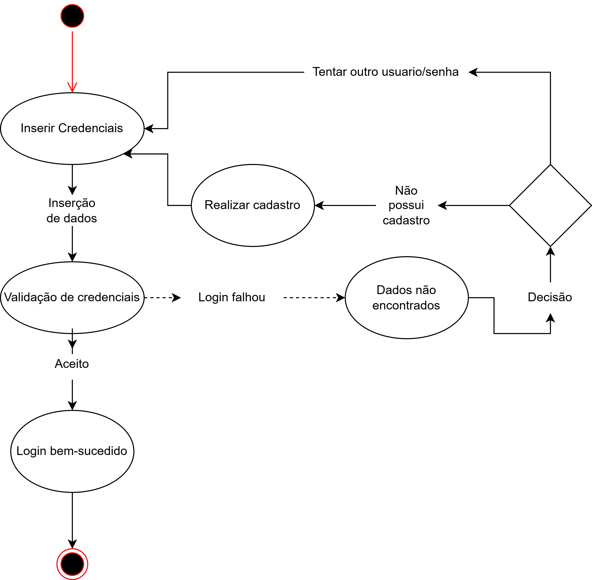
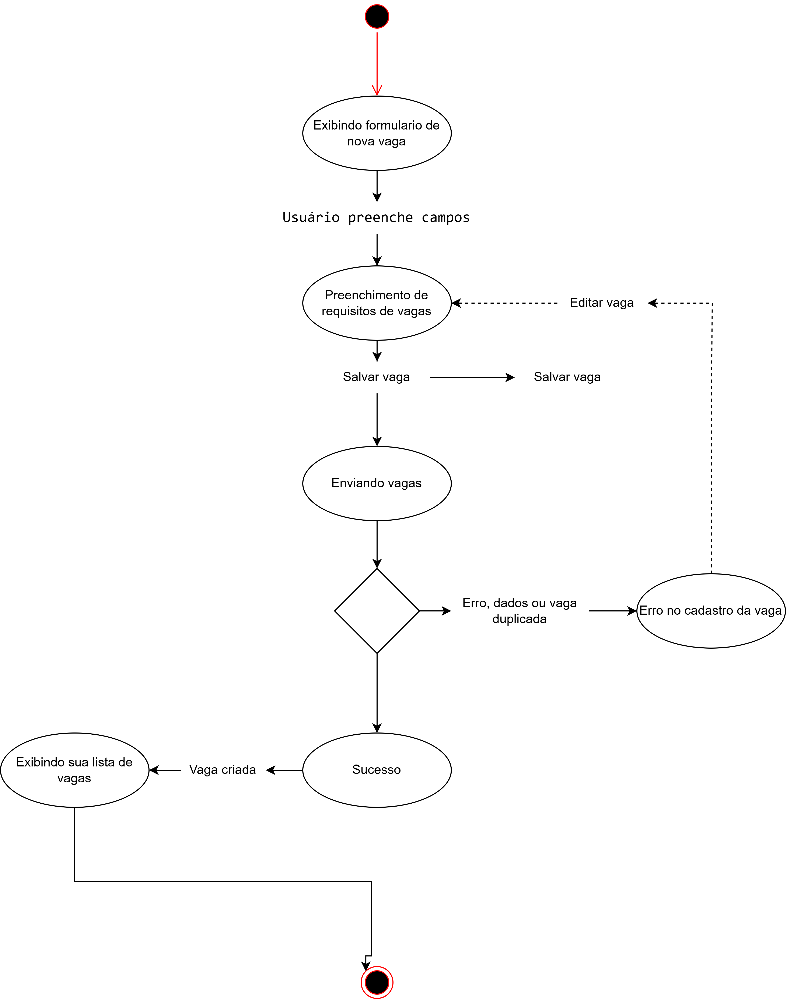
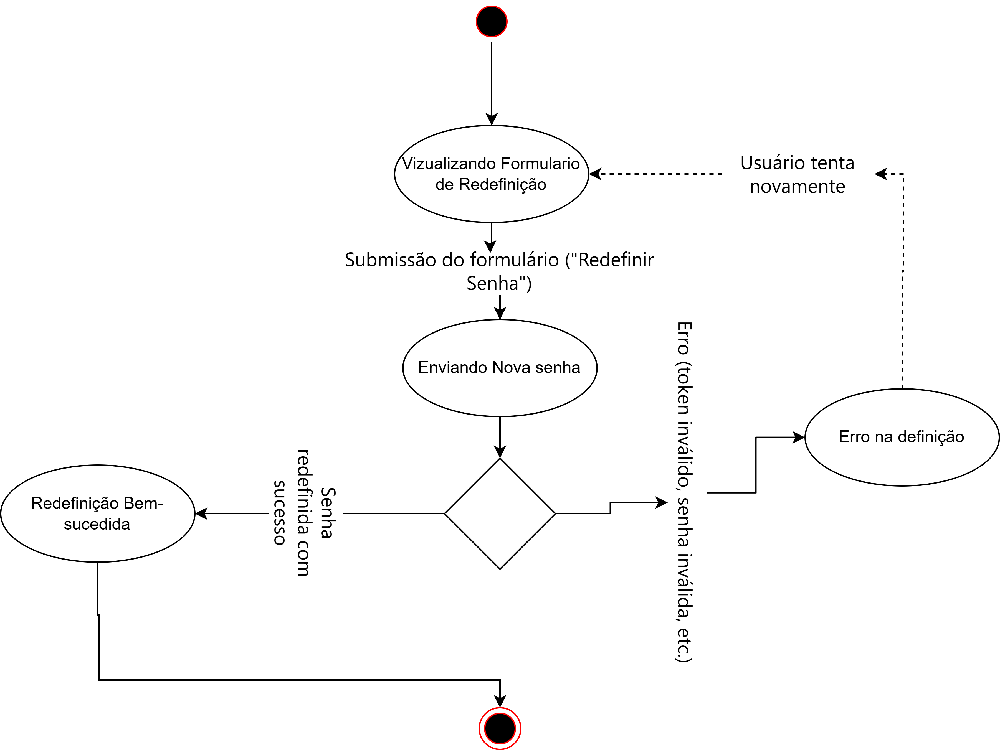

# DIAGRAMA DE ESTADOS

Este documento apresenta os diagramas de estado que representam os fluxos de funcionalidades do sistema.

**Autores:** Nicolas Rocha e Mayro Sá

---

### Login
*Representa o fluxo de autenticação do usuário no sistema.*

### Cadastro de Candidato
*Descreve as etapas para um novo candidato se registrar na plataforma.*

### Cadastro de Empresa
*Descreve as etapas para uma nova empresa se registrar na plataforma.*

### Cadastro de Vaga
*Fluxo seguido pela empresa para publicar uma nova oportunidade de vaga.*

### Edição de Perfil de Candidato
*Mostra os estados possíveis durante a atualização das informações do perfil do candidato.*

### Candidatura (Visão do Candidato e Empresa)
*Diagrama que representa o processo de candidatura a uma vaga, abrangendo as perspectivas tanto do candidato quanto da empresa que a visualiza.*

### Recuperação de Senha
*Fluxo para que um usuário possa redefinir sua senha de acesso caso a tenha esquecido.*

