# DIAGRAMAS DE CASOS DE USO

A apresentação dos diagramas de caso de uso a seguir é dividida em dois subsistemas principais: **Empregador** e **Candidato**. Para algumas funcionalidades, há um diagrama de caso de uso simples, que foca na interação principal, e uma versão "Complexa", que detalha o fluxo completo, incluindo ações prévias necessárias, como o login.

## Subsistema Empregador
Esta seção detalha os casos de uso relacionados às ações que um empregador pode realizar no sistema.

### 1. Cadastro de Empregador
O diagrama abaixo ilustra o processo de cadastro de um novo empregador no sistema.
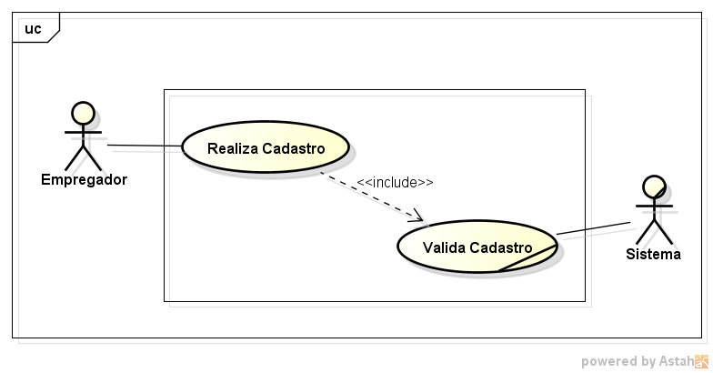

### 2. Login de Empregador
Este diagrama apresenta a funcionalidade de autenticação do empregador.

#### Visão Complexa
Este diagrama mais detalhado ilustra o fluxo completo, incluindo a etapa de cadastro como pré-condição para o login.

### 3. Alteração de Status do Empregador
Estes diagramas descrevem como um administrador ou o próprio sistema pode alterar o status de um empregador (e.g., de "pendente" para "aprovado").

#### Visão Simples
Apresenta a funcionalidade principal de alteração de status.
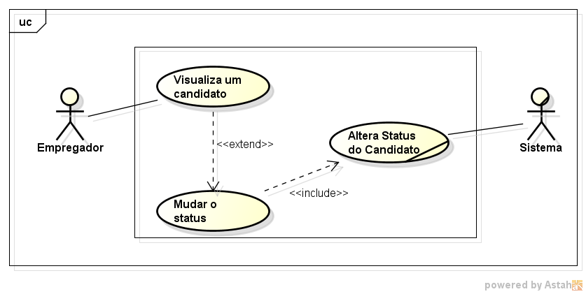

#### Visão Complexa
Mostra o processo completo, que exige que o administrador esteja logado para poder realizar a alteração de status de um empregador.

### 4. Gestão de Vagas
O empregador pode visualizar as vagas que cadastrou no sistema.

### 5. Visualização de Candidatos
Após publicar vagas, o empregador pode visualizar a lista dos candidatos que se aplicaram. Este caso de uso mostra o empregador visualizando a listagem de todos os candidatos de uma determinada vaga.
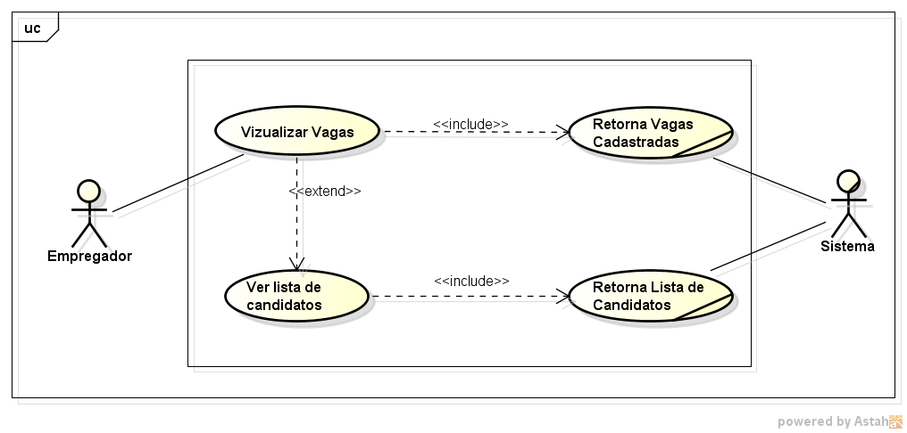

#### Perfil do Candidato
Aqui, o empregador seleciona um candidato da lista para visualizar seu perfil detalhado.											
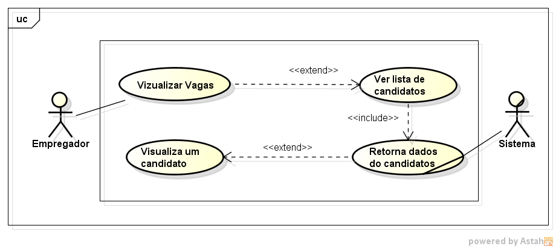

### 6. Perfil do Empregador
Este diagrama detalha o fluxo para o empregador visualizar e gerenciar seu próprio perfil, ação que requer autenticação prévia.
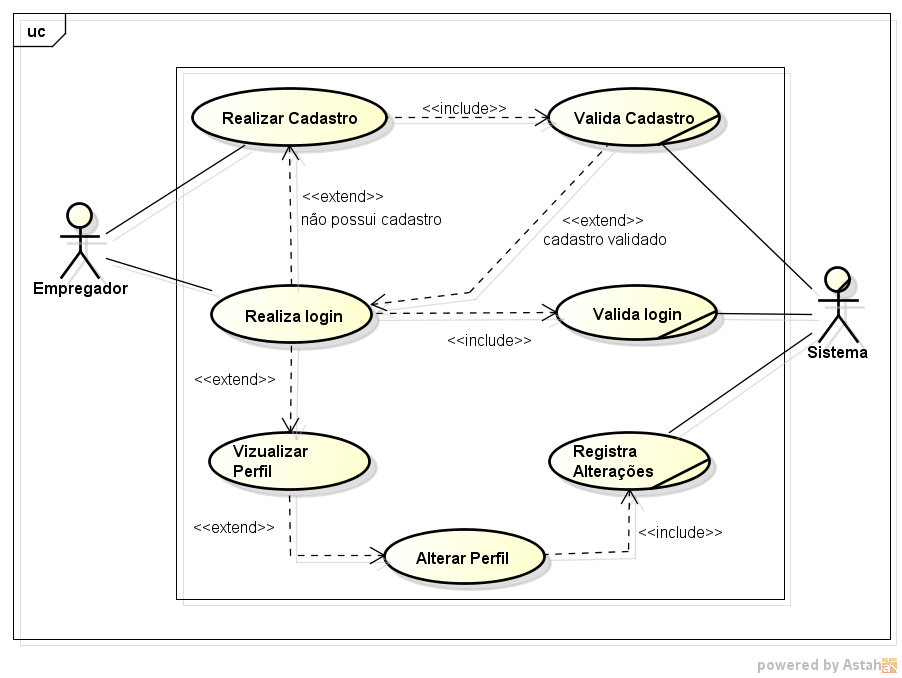

Uma visão mais simplificada do fluxo.

## Subsistema Candidato
Esta seção detalha os casos de uso relacionados às ações que um candidato pode realizar no sistema.

### 1. Cadastro de Candidato
Ilustra o processo de registro de um novo candidato na plataforma.
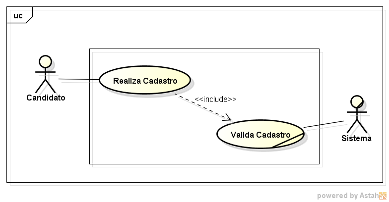

### 2. Login de Candidato
Descreve a autenticação do candidato no sistema.

#### Visão Simples
Mostra a interação direta do candidato para efetuar o login.
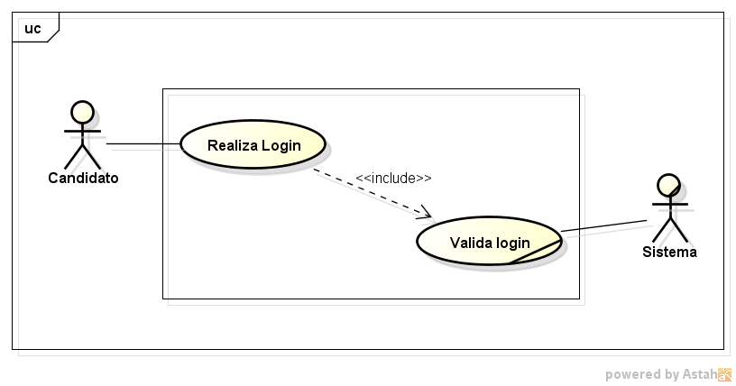

#### Visão Complexa
O diagrama expandido mostra que o cadastro é um passo necessário antes que o login possa ser realizado.
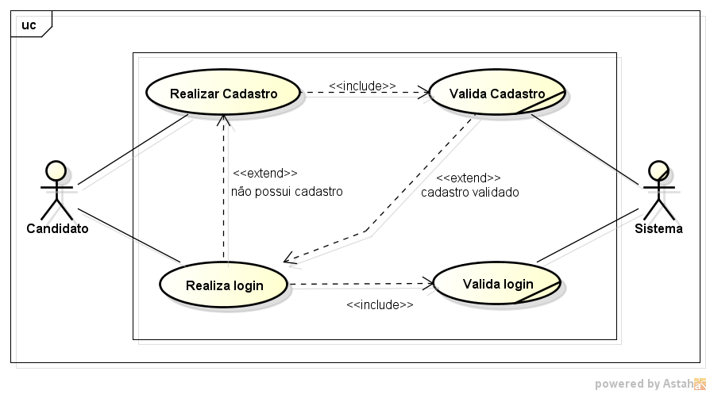

### 3. Busca e Visualização de Vagas
O candidato pode procurar e visualizar as vagas de emprego disponíveis.

#### Visão Simples
Foca na ação de buscar e listar as vagas.
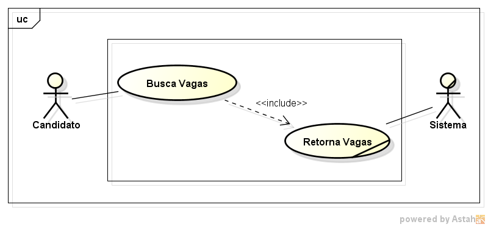

#### Visão Complexa
Ilustra o fluxo desde o login do candidato até a visualização das vagas.
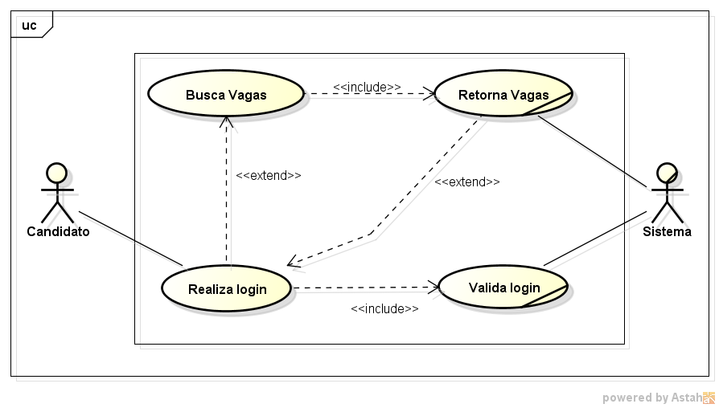

### 4. Candidatura a uma Vaga
Detalha o processo de um candidato se aplicar para uma vaga de interesse.

#### Visão Simples
Mostra a ação principal de se candidatar a uma vaga.
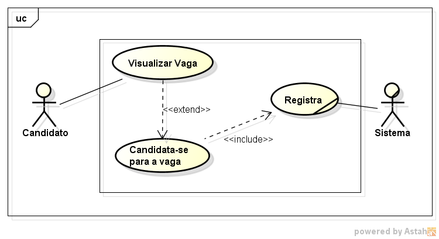

#### Visão Complexa
Apresenta o fluxo completo: o candidato precisa estar logado e visualizar uma vaga para então poder se candidatar.
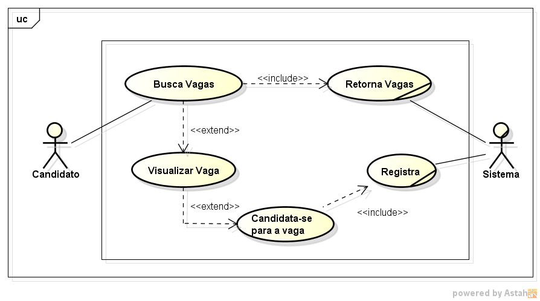

### 5. Perfil do Candidato
Este diagrama mostra o fluxo para o candidato visualizar e gerenciar seu próprio perfil, que requer que ele esteja logado no sistema.

#### Visão Simples
Mostra a interação direta do candidato para alterar  as informações perfil.
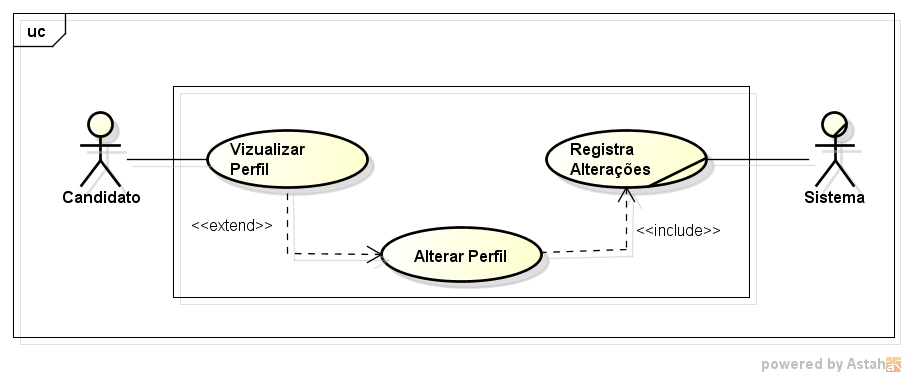

#### Visão Complexa
O diagrama expandido mostra como o usuário alterando as informações de perfil, considerando ações anteriores.
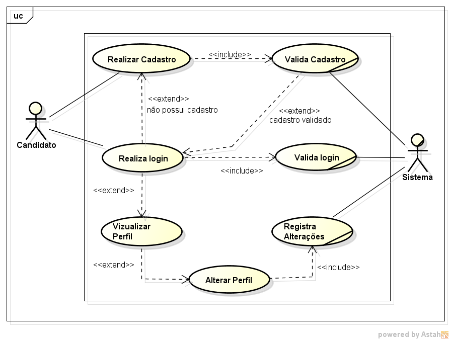